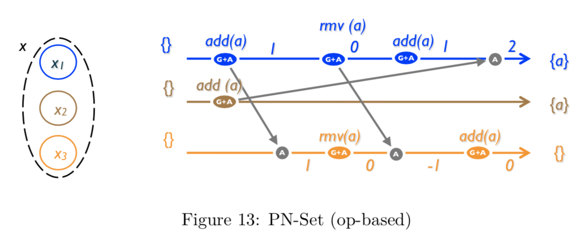

## CRDT : Towards Eventual Consistency
by jiangplus

---

# Eventual Consistency

 * CAP 定理 要求必须在 availability, consistency 和 partition-tolerance 之间取舍

 * 传统和主流的数据库都强调故障下的全局一致性，带来性能和可扩展性的瓶颈

 * 另一种途径是 eventual consistency 或 optimistic replication

 * 节点在无需同步下进行操作，异步传播变更，每个副本最终接收所有变更达到一致性

---

# DynamoDB

 * 通过乐观的复制提高可用性
 * 数据的变更在后台进程异步的复制到其他副本，并容忍网络断开
 * 当发现冲突的变更时，需要进行处理
 * 最终一致性数据库

---

#### 什么时候处理冲突

 * 对传统的数据库来说，冲突的变更是在写入时处理的，当更新不能取得大多数节点的认可，就写入失败

 *  “always writeable”，冲突是在读取和分发的时候处理的

#### 谁来处理冲突

 * 应用逻辑决定冲突处理规则

 * “last write wins” 策略

---

---

# 可伸缩性

 * Dynamo 要求保持增量的可伸缩性，动态对节点上的数据分区，使用一致性哈希来分配负载

 * 根据 key 的范围构成一个环，每个节点分配一个随机 ID，代表在环上的位置

 * 由于每个节点的能力往往是不一样的，一个物理节点会分配多个虚拟节点 vnode

 * 每个数据会分发到多台机器上，一个 key 的相关节点构成 preference list

 * 用 merkle tree 进行数据的同步，根据 key range 生成相应 merkle tree，可以快速判断共同的 key

---

# 一致性

 * 不同节点上可能对同一条数据发送并发更新，每次更新数据会生成新的不可变的版本

 * 数据会带有 vector clock 版本号，更新的时候需要带上读取的版本号，并且生成新的版本

 * 如果出现并发的冲突版本，由客户端解决冲突并写入新数据

 * Dyanmo 使用 quorum 机制保持一致性，每条数据如果总共有 N 个副本，必须在 R 个节点上读取成功，W 个节点上写入成功，并且 R + W > N，保证数据的一致性。

---

# CRDT

 * Convergent or commutative replicated data type
 * Conflict-free replicated data type
 * 在数学上能确保具有最终一致性
 * 不需要同步，可以本地立即更新，与网络的延迟和时效无关
 * scalable and fault-tolerant

---

---

### state-based and operation-based

 * In state-based (or passive) replication, an update occurs entirely at the source, then propagates by transmitting the modified payload between replicas.

 * In operation-based (or active) replication, the system transmits operations.

---

### CvRDT

 Two replicas xi and xj of an object x converge eventually if the following conditions are met:

• Safety: ∀i,j : C(xi) = C(xj) implies that the abstract states of i and j are equivalent.

• Liveness: ∀i,j : f ∈ C(xi) implies that, eventually, f ∈ C(xj).

A type with these properties will be called a Convergent Replicated Data Type or
CvRDT.

---

### CmRDT

In an op-based object, a reliable broadcast channel guarantees that all updates are delivered at every replica, in the delivery order < d specified by the data type.  

If all concurrent operations commute, then all execution orders consistent with delivery order are equivalent, and all replicas converge to the same state. 

Such an object is called a Commutative Replicated Data Type (CmRDT).

---

# Counters

 * op-based counter

 * State-based increment-only Counter (G-Counter)

---

# Counters

 * PN-Counter

 * Non-negative Counter

---

# Register

 * A register is a memory cell storing an opaque atom or object (noted type X hereafter). 
concurrent updates do not commute

 * A Last-Writer-Wins Register (LWW-Register) 

 * Multi-Value Register (MV-Register)

---

---

# Sets

 * Grow-Only Set (G-Set)

avoid remove altogether

 * 2P-Set

Two-Phase Set (2P-Set) is a Set where an element may be added and removed, but never added again thereafter. It combines a G-Set for adding with another for removing. the effect of the remove still takes precedence.

---

# Sets

 * LWW-element-Set

 * PN-Set

 * Observed-Remove Set (OR-Set)

---

---

# Thank you